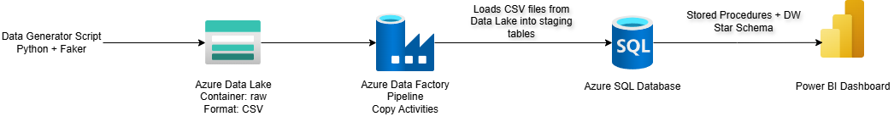
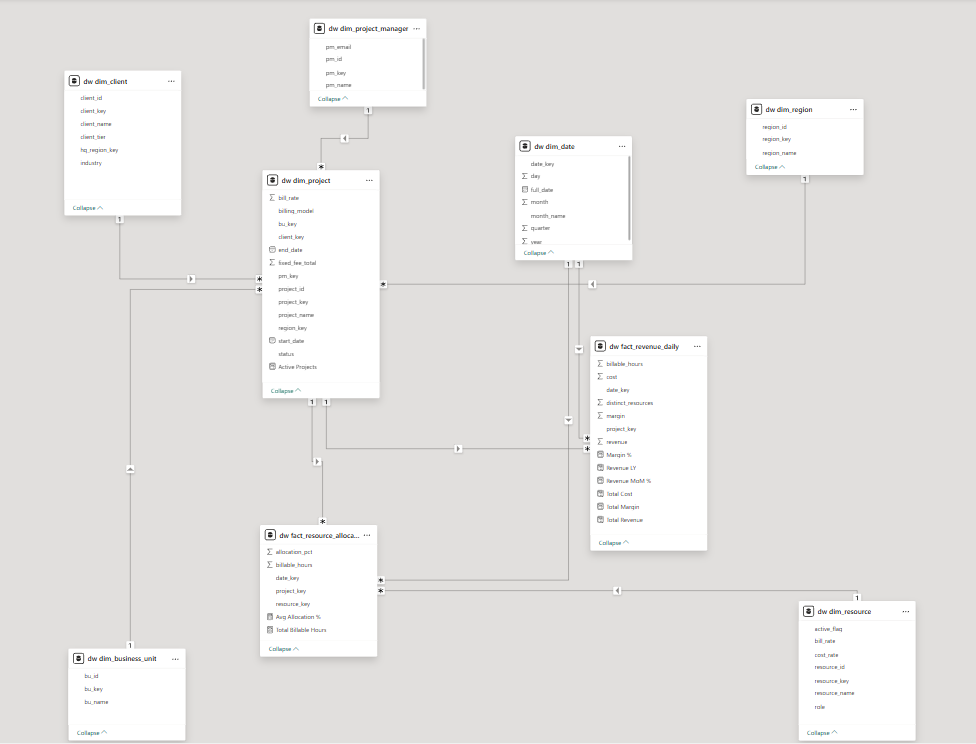
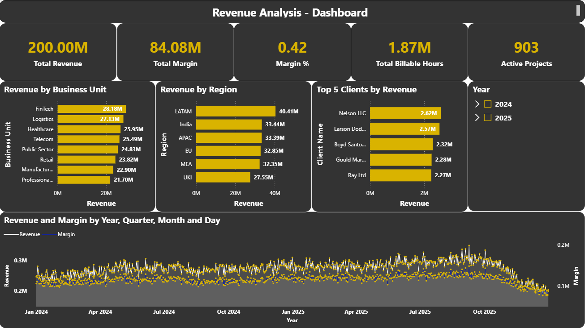

# Azure Revenue Intelligence Data Platform

End-to-end Azure data engineering project that simulates an enterprise
revenue intelligence platform for a professional services organization.

The system ingests synthetic operational data, processes it through an
Azure-based data pipeline, stores it in a star schema data warehouse,
and delivers business insights through Power BI dashboards.

## Project Overview

This project simulates a real-world enterprise analytics platform used
by consulting and professional services firms to monitor revenue,
project profitability, and workforce utilization.

The platform performs the following functions:

• Generates realistic enterprise operational data using Python  
• Stores raw data in Azure Data Lake Storage  
• Ingests data using Azure Data Factory pipelines  
• Transforms and models the data inside an Azure SQL data warehouse  
• Implements a star schema optimized for analytics  
• Serves business insights through Power BI dashboards  

The solution processes hundreds of thousands of records representing
projects, resources, clients, and revenue transactions.

## Architecture

### Architecture Components

**Synthetic Data Generator**
Python script that generates enterprise-scale datasets representing
clients, projects, resources, revenue transactions, and allocations.

**Azure Data Lake Storage**
Raw container used to store generated CSV datasets before ingestion.

**Azure Data Factory**
Pipeline used to ingest raw data into staging tables within Azure SQL.

**Azure SQL Database**
Enterprise data warehouse implementing a star schema for analytics.

**Power BI**
Business intelligence dashboards used for revenue and profitability analysis.

## Data Model

The warehouse follows a star schema design.

### Fact Tables

fact_revenue_daily  
fact_resource_allocation_daily  

### Dimension Tables

dim_project  
dim_client  
dim_resource  
dim_region  
dim_project_manager  
dim_business_unit  
dim_date  

Surrogate keys are used to optimize joins and support scalable analytics queries.

## Data Pipeline

The data pipeline follows an ELT architecture.

### 1 Data Generation

A Python script generates realistic enterprise operational datasets
using Faker and NumPy.

### 2 Raw Data Storage

Generated CSV files are uploaded to Azure Data Lake Storage.

### 3 Data Ingestion

Azure Data Factory pipelines ingest the raw files into staging tables
within Azure SQL Database.

### 4 Data Transformation

Stored procedures transform staging data into a star schema warehouse.

### 5 Analytics Layer

Power BI connects to the warehouse to deliver analytics dashboards.

## Incremental Loading Strategy

Fact tables use an incremental loading strategy.

New records are inserted based on composite keys containing
date_key, project_key, and resource_key.

This approach avoids full table reloads and allows the pipeline to
scale efficiently as data volumes increase.

A sliding window approach can also be used in production systems
to reload recent partitions where data corrections may occur.

## Power BI Dashboard

### Dashboard Pages

**Revenue Intelligence**

Tracks overall company revenue, margin, and growth trends.

**Project Profitability**

Identifies the most and least profitable projects.

**Resource Utilization**

Monitors workforce allocation and billable utilization.

## Scaling Strategy

If the dataset grows to hundreds of millions of rows:

• Fact tables can be partitioned by date
• Columnstore indexes can be added for compression
• Azure Data Factory pipelines can orchestrate ETL
• Data can be stored in Synapse for large-scale analytics

## Business Questions Answered

The dashboard enables leadership to answer the following questions:

• Which projects generate the highest revenue and margin?  
• Which clients contribute the largest share of company revenue?  
• Which projects are experiencing margin erosion?  
• How is overall company revenue trending over time?  
• What is the total revenue generated across all projects?
• What is the overall profit margin?
• Which business units generate the highest margins?
• Which regions underperform in revenue growth?